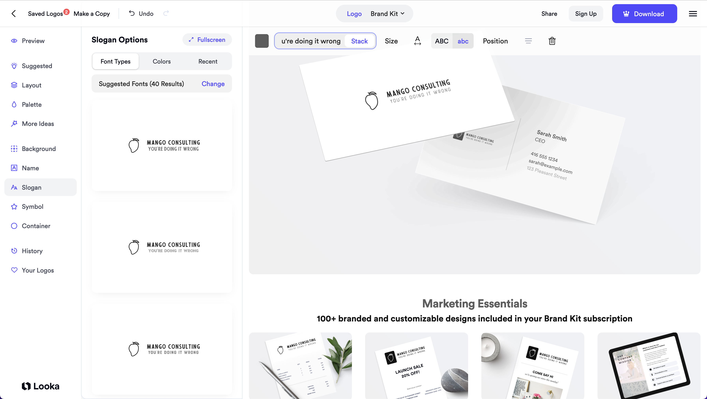

Recently had to work on a website which needed a logo.

You clearly have 2 options:
1. **You ask a logo designer**. This is a real job, people. If the success of your business is going to be largely impacted by your branding, then don't be a fool and ask someone whose job is exactly this to do it for you. And pay her/him what she/he's asking
2. Your logo ain't gonna make such a difference and you just want to get a logo on the cheap and are willing to do this yourself.

Let's look at a few tips/tools you can use to do this:

- Look up your competition and check what they're doing
- Use dribbble.com to check out inspirations
- Use a napkin, some paper, or an app like Procreate to doodle your shit
- Use logo makers such as [Looka](https://looka.com/) to visualise what something would look like on other material (business cards, tshirts, signs...etc). *See below for an example*
- Search [dafont](https://www.dafont.com/) for fonts you can use for free, and download
- Build your vector graphics using open source applications such as [Inkscape](https://inkscape.org/). You can learn how to use it by checking out [Logos by Nick](https://www.youtube.com/c/LogosByNick)

This list is likely to grow with time but that'll do for now.

So long.

